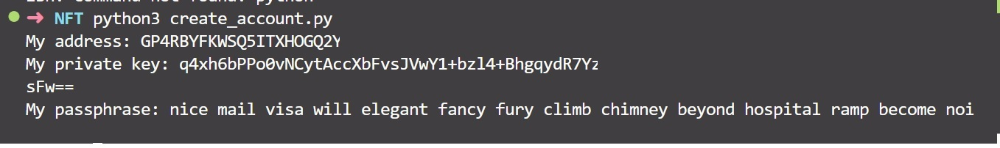
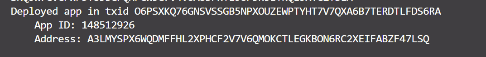

# Crear tu contrato inteligente con beaker

En este repositorio vamos usar el SDK de python de algorand junto a Beaker para crear nuestro primer contrato inteligente desplegado en testnet.


## Prerequisitos

Por favor instale o tenga instalado lo siguiente:

- [python](https://www.python.org/downloads/)

## Tareas necesarias

Antes de crear nuestro contrato inteligente debemos cumplir con los siguientes pasos:

1. [Instalar sdk python](https://github.com/algorand/py-algorand-sdk), al ejecutar el siguiente comando procederemos con la instalación.

```bash
pip install py-algorand-sdk 
```

2. Instalar Beaker actualmente requiere una versión >= 3.10, para ello debes ejecutar el siguiente comando.

```bash
pip install beaker-pyteal 
```

3. Crear una cuenta

Vamos usar el SDK para crear una nueva cuenta, para ello simplemente debemos ejecutar el comando

```bash
python create_account.py
```

Obtendremos un resultado como el siguiente



Si ya tienes una cuenta creada simplemente debemos validar que tenga fondos suficientes para desplegar los contratos intelgentes.

Para fondear la cuenta con el [Algo Dispenser](https://dispenser.testnet.aws.algodev.network/)

4. Crear archivo de variables de entorno

Puedes agregar tus variables de entorno en el archivo `.env`, reemplazando los datos de acuerdo a los que te arroje el script create_account.py este proceso se debe realizar solamente una vez:

```
PASSPHRASE= ""
```
Para poder usar la información de nuestro archivo `.env` debemos instalar la siguiente dependencia.

```bash
pip install python-dotenv
```

## Ahora si ya estamos listos 

1. Debes ejectuar el script deploy.py, el cual va a desplegar el contrato inteligente en la red Testnet. Si el proceso se realizó de forma exitosa deberias ver una salida en tu termina como la siguiente.



2. Ahora solamente resta ejecutar el script client.py, en el cual en la linea 33 podemos cambiar el nombre que deseamos se envie a la función del contrato inteligente.

## Recursos

Si quieres profundizar sobre Algorand y Beaker puedes ingresar en los siguientes enlaces:

* [Documentación Algorand](https://developer.algorand.org/)
* [Documentación Beaker](https://beaker.algo.xyz/)

## Licencia

This project is licensed under the [MIT license](LICENSE).
